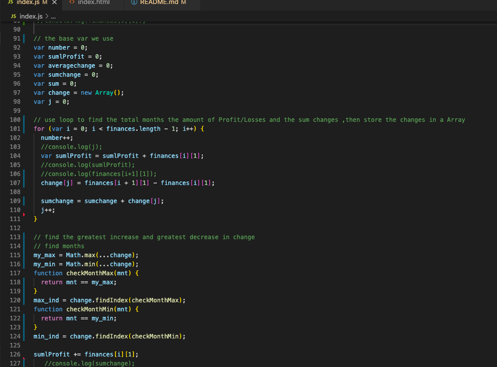
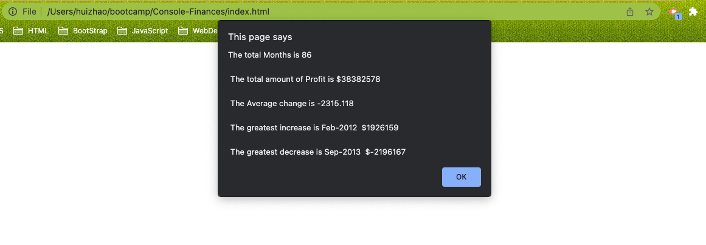

# Console-Finances
## It's a code that analyzes the records to calculate Date and Profit/Losses, it has five function.
* The total number of months included in the dataset
* The net total amount of Profit/Losses over the entire period
* The average of the changes in Profit/Losses over the entire period
* The greatest increase in profits (date and amount) over the entire period
* The greatest decrease in losses (date and amount) over the entire period
## There are some screenshots

## This is the link
*  https://joy-hui.github.io/Console-Finances/

